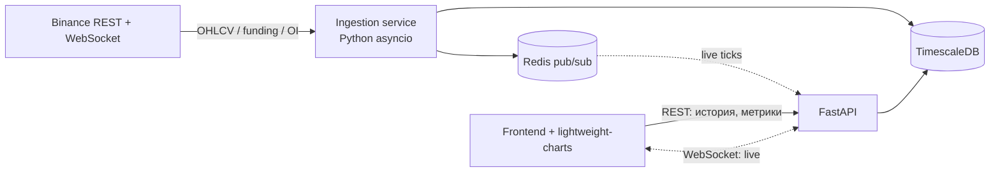

# Perp Screener — мульти-ассет скринер крипто-перпетуалов

> Скринер бессрочных фьючерсов (perpetual futures) с Binance: ингест тайм-серий →
> хранение в TimescaleDB → **аналитика на SQL** (оконные функции, перцентили, z-score) →
> REST/WebSocket API → live-дашборд. Проект-портфолио аналитика-разработчика:
> акцент на пайплайне данных, моделировании тайм-серий и нетривиальном SQL.

[](https://github.com/mersuubi/Perp-Screener/actions/workflows/ci.yml)


---

## TL;DR — что это и зачем

Трейдеру нужно отслеживать десятки перпов по нескольким условиям одновременно
(аномальный объём, всплеск волатильности, перегретый funding, отток open interest).
Руками это невозможно. Скринер забирает данные с биржи, считает метрики **на стороне БД**
и отдаёт отсортированную витрину + сохраняет воспроизводимые «прогоны» скрининга.

**Главная ценность для рекрутёра** — не свечи, а:
- идемпотентный ETL-пайплайн (батч-бэкофилл + WS-стрим, `ON CONFLICT`, авто-реконнект);
- моделирование тайм-серий (гипертаблицы, continuous aggregates 1m→5m→1h);
- аналитика на **оконных функциях SQL** (`stddev() OVER`, `percent_rank()`, `first_value()`);
- задокументированные решения (PRD, C4, ER, ADR, OpenAPI).

---

## Архитектура



Три независимых процесса — **разделение ответственности**:
1. **Ingestion** — держит WS-коннекты, пишет в БД, публикует тики в Redis. Падение ингеста не роняет API.
2. **API (FastAPI)** — отдаёт историю/метрики из БД, проксирует live из Redis в WS клиенту.
3. **Frontend** — только рендер, никакой бизнес-логики.

Подробнее: [docs/architecture-c4.md](docs/architecture-c4.md).

---

## Аналитика (главный SQL-флекс)

Все метрики считаются **в БД**, не в Python. Примеры — в [db/queries/](db/queries/).

**Скользящая волатильность + z-score объёма + доходность за окно** ([rolling_metrics.sql](db/queries/rolling_metrics.sql)):

```sql
SELECT symbol, bucket, close,
       stddev(close)  OVER w                                            AS vol_20,
       (volume - avg(volume) OVER w) / nullif(stddev(volume) OVER w, 0) AS volume_zscore,
       close / first_value(close) OVER w - 1                            AS ret_window
FROM ohlcv_5m
WINDOW w AS (PARTITION BY symbol ORDER BY bucket ROWS BETWEEN 19 PRECEDING AND CURRENT ROW);
```

**Ранжирование кандидатов скринера** ([screener_ranking.sql](db/queries/screener_ranking.sql)) — `percent_rank()` по объёму за 24ч,
`rank()` по диапазону цены.

---

## Стек

| Слой | Технология |
|---|---|
| Источник | Binance public futures API (raw REST + WebSocket) |
| Ингест | Python `asyncio`, `aiohttp`, `websockets` |
| Хранилище | PostgreSQL 16 + TimescaleDB (гипертаблицы + continuous aggregates) |
| Шина | Redis pub/sub |
| API | FastAPI + Pydantic (автоген OpenAPI) |
| Фронт | Vanilla TS + Vite + lightweight-charts |
| Деплой | Docker Compose |

---

## Как поднять локально

```bash
cp .env.example .env      # впишите ключи (для публичных данных Binance не нужны)
docker compose up -d      # поднимет timescaledb, redis, ingestion, api, frontend
```

- API + Swagger UI: http://localhost:8000/docs
- Frontend: http://localhost:5173
- Бэкофилл истории запускается автоматически при старте ingestion-сервиса.

Локальная разработка без Docker — см. [docs/dev.md](docs/dev.md).

---

## Документация (`/docs`)

| Артефакт | Файл |
|---|---|
| PRD / требования | [docs/PRD.md](docs/PRD.md) |
| C4-диаграммы | [docs/architecture-c4.md](docs/architecture-c4.md) |
| ER-диаграмма | [docs/er-diagram.md](docs/er-diagram.md) |
| ADR | [docs/adr/](docs/adr/) |
| API (OpenAPI) | [docs/api.md](docs/api.md) · live: `/docs`, `/openapi.json` |

---

## Структура репозитория

```
.
├── db/          — SQL: схема, гипертаблицы, continuous aggregates, аналитические запросы
├── ingestion/   — asyncio-воркер: бэкофилл (REST) + стрим (WS) + publish в Redis
├── api/         — FastAPI: история, метрики, скринер, WS-фанаут
├── frontend/    — vanilla TS + lightweight-charts (тонкий клиент)
├── docs/        — PRD, C4, ER, ADR, OpenAPI
└── docker-compose.yml
```

---

> ⚠️ Демо — read-only витрина данных. Никаких ключей на проде, ордеров, депозитов.
