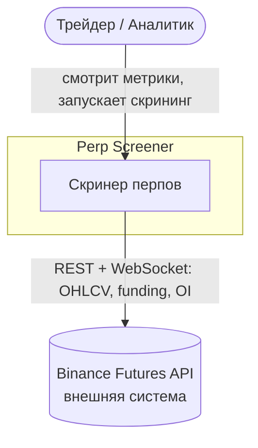
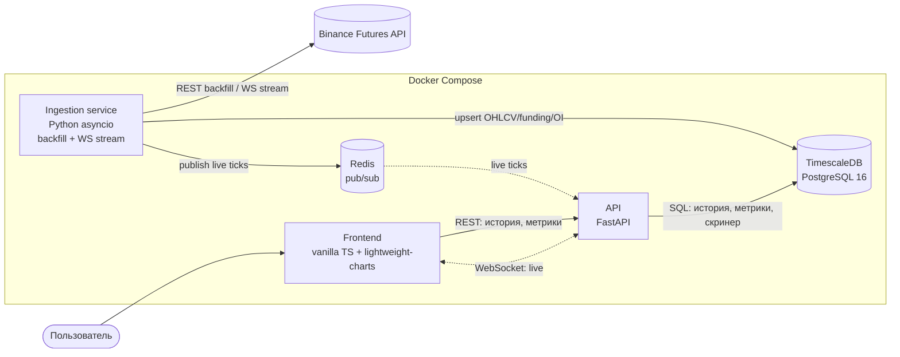
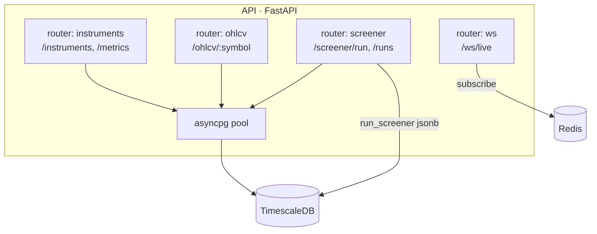

# Архитектура — C4

C4-модель: уровни Context → Container → (Component опционально).

## Level 1 — System Context

Кто пользуется системой и с какими внешними системами она взаимодействует.

## Level 2 — Container

Из каких развёртываемых единиц состоит система и как они общаются.

**Почему именно так** (детали — в `adr/`):
- **Отдельный ingestion-процесс** — держит WS-коннекты и пишет в БД независимо от API
  (ADR-0004). API можно перезапустить, не теряя стрим.
- **Redis между ингестом и API** — развязка: ингест публикует тики, API подписан и
  фанаутит клиентам. Ни один не блокирует другой (ADR-0003).
- **TimescaleDB** — гипертаблицы + continuous aggregates под тайм-серии (ADR-0001).
- **Тонкий фронт** — только рендер, вся аналитика в БД.

## Level 3 — Component (API, опционально)

Внутреннее устройство контейнера API.

