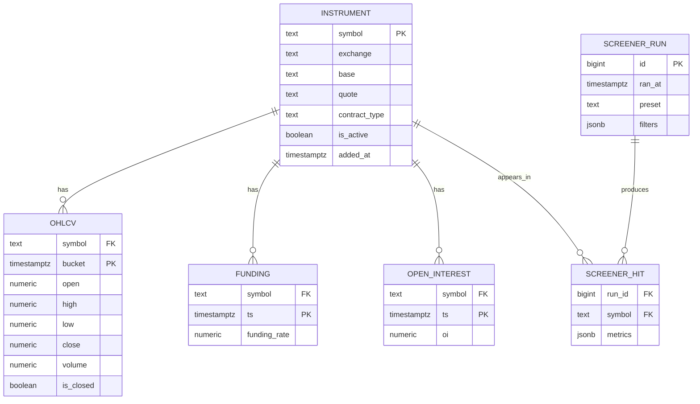

# ER-диаграмма

Модель данных. Тайм-серийные таблицы (`ohlcv`, `funding`, `open_interest`) —
гипертаблицы TimescaleDB; `ohlcv_5m`/`ohlcv_1h` — continuous aggregates поверх `ohlcv`.

## Ключевые решения

- **`ohlcv` — гипертаблица**, партиционирование по `bucket` (1 чанк = 1 день).
  PK `(symbol, bucket)` → идемпотентный апсерт `ON CONFLICT (symbol, bucket) DO UPDATE`.
- **Даунсемплинг** через continuous aggregates `ohlcv_5m`, `ohlcv_1h` —
  считаются инкрементально, фронт не дёргает миллион 1m-строк.
- **`screener_run.filters` (jsonb)** хранит условия прогона, `screener_hit.metrics`
  (jsonb) — снимок метрик инструмента на момент прогона. Это делает скрининг
  **воспроизводимым**: можно вернуться к прошлому прогону и увидеть, что сработало.
- Все временные метки — `timestamptz` в UTC (NFR-1).

## Производные объекты (VIEW)

| Объект | Что считает |
|---|---|
| `ohlcv_5m_enriched` | скользящая волатильность, z-score объёма, доходность за окно |
| `window_returns` | доходность 5м/1ч/24ч |
| `funding_latest` | текущий funding + z-score за 30 дней |
| `oi_change` | изменение open interest за 1ч/24ч |
| `metric_snapshot` | **витрина скринера**: всё вместе + рыночные перцентили/ранги |
